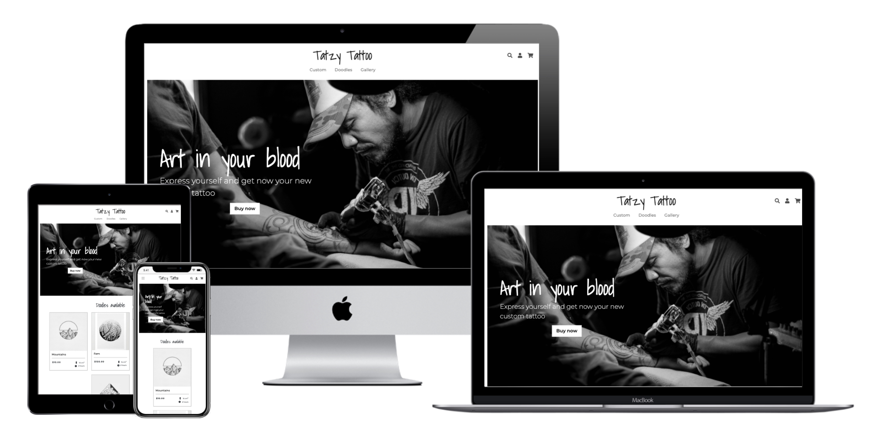
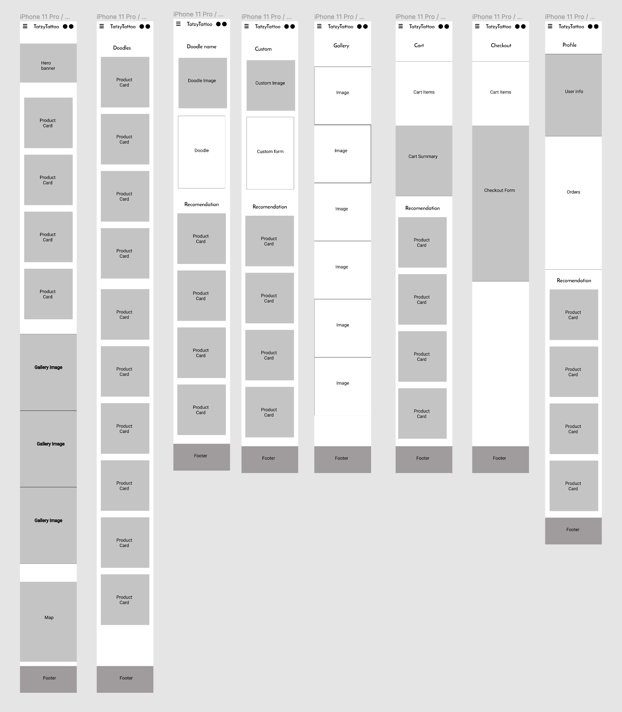
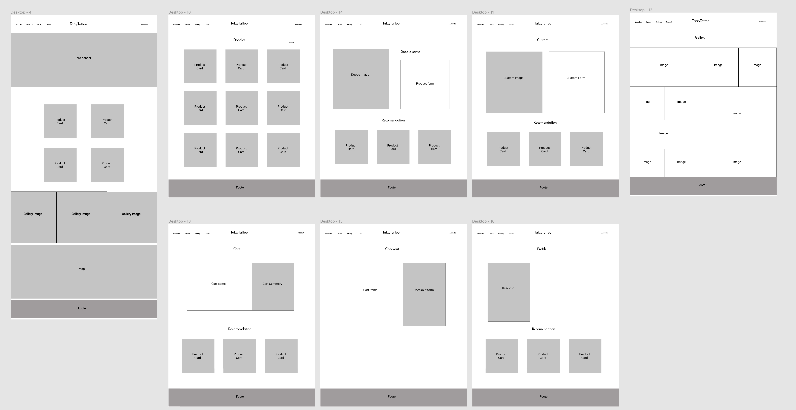
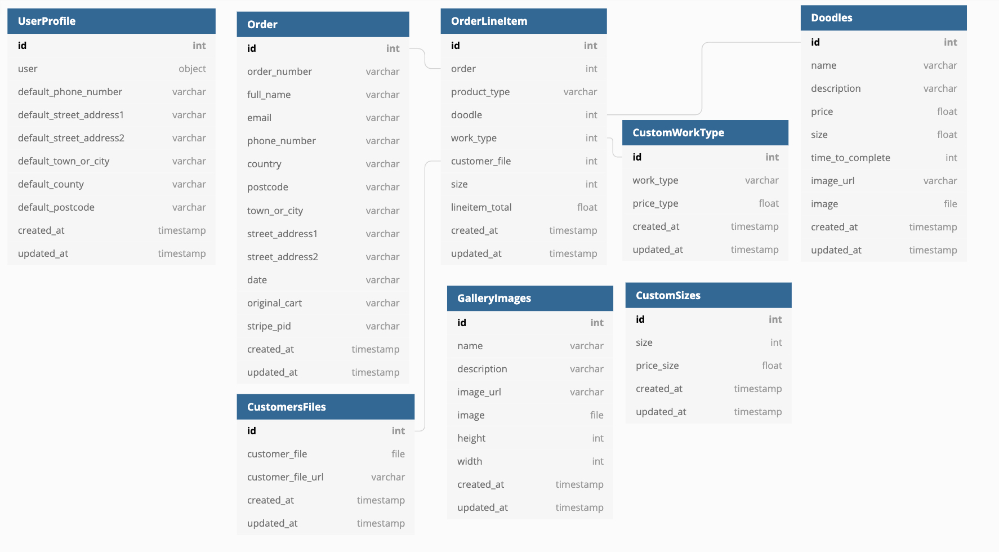

# **Tatzt Tattoo**

## **Backend Development Project - Code Institute**

&nbsp;


Tatzy Tatto is an e-commerce website created to sell custom and pre-designed tattoos from a local Tatoo Artist. The objective of this website help the artist merchandise his tattoo products and make it easier for his customer to buy a tattoo session.

This is my final project of the Code Institute Full Stack Developer course and aims to show an interactive e-commerce website using a full technology stack, from the Front End to the Back End and Databases.

Access the website here: [Tatzy Tattoo](http://tatzy-tatoo.herokuapp.com/)

&nbsp;

## **Table Of Contents**

- [User Experience](<#user-experience>)
- [Design Process](#design-process)
- [Features](#features)
- [Technologies Used](#technologies-used)
- [Testing](#testing)
- [Deployment](#deployment)
- [Credits](#credits)
- [Acknowledgments](#acknowledgments)

&nbsp;

## **User Experience**

### **Project Goals:**

- Display a home page with a call to action to the products available for purchase, the photos of the last works made by the artist, and his location.
- Have a product page for customers to buy a custom tattoo, where they can select the kind of work they want, the size of their tattoo, and upload a reference image, which calculates automatically the price.
- Merchandise the Artist's pre-made tattoo designs, displaying its price, size, and time to complete, and where the customer can easily buy it.
- Have a User database where merchants can log in to the website and have control of their past orders.
- Have a management area where only the Admin can access to add new Doodle products or images to the Gallery.
- Hava a cart and checkout, making it possible to buy more than one product at once.

### **User Stories**

#### **New Users:**

- I'm looking for a tattoo artist to have a new custom tattoo of a cool design my sister drew for me.
- I want a new tattoo, but I'm out of ideas and would like to check what the tattoo artist has available and ready.
- I looking for a tattoo artist work and would like to see his past works so I can be sure that he is the right one for me.

#### **Returning User:**

- I bought a custom tattoo a week ago and would like to check my order information.
- I got a Doodle tattoo last month and now I'd like to buy a new custom one.

#### **Business Owner:**

- I'm a tattoo artist and would like to make the process to buy a tattoo from me easier
- I have loads of pre-made designs, and would like to merchandise those Doodles, so my customers can easily find and buy them.
- I need a website where I can simply manage the Doodles available, and add my newest works in an Image Gallery.

## **Design Process**

### **Strategy Plane:**

The main objective of this website is to make it easier for a customer to buy tattoos from this artist, as he does not have anyone working for him to attend to those clients. The time he spends negotiating tattoos can be much better used tattooing his clients.

For that, the owner decided to request the creation of simple and straightforward e-commerce, where his customer can easily buy their tattoos online.

### **Scope Plane:**

The key features that this project aims to attend are:

- A custom tattoo page that automatically calculates the final price depending on the work type and size
- A page with the Collection of all Doodles available, where the merchant access the Doodle page to buy it.
- An image Gallery page where customers can see the artist's last works.
- A seamless Cart and Checkout process, where customers can easily buy the website products.
- A User database where the artist will have his customer information saved in case he needs it for a future project, which also provides a Login/Sign-in system on his store.

### **Skeleton Plane:**

The wireframes of this project aimed to create simple but effective pages, where the information can be seen and collected easily, and only necessary elements are displayed. For that, it was decided that the website wouldn't have many images, so it can load fast as well.

The layout of the wireframes was designed using Figma, as a starting point of how to display the project goal in a simple and direct format, on any kind of device.

To improve page load speed, it was decided to not add external Font styles in this project. The visual style was developed taking into consideration the elements and styles available on the Materialize CSS Framework, that will be used to develop the website.

### **Wireframes**:

The project wireframes can be accessed [clicking here](https://www.figma.com/file/aK6FhbMts1jMkbbAZRDPEO/Tatzy-Tattoo?node-id=0%3A1).

Mobile:



Tablet / Desktop:



### **Surface Plane:**

#### **Desing:**
The design of this store was created to relate to the artist's work, which is minimal, edgy, and detailed. The Doodles are displayed on custom product cards, that provide all the important information about those products.

All pages can be easily accessed through the Header navigation menu, which in the mobile view is displayed through a hamburger icon and a collapsible menu for the best usage of space. The Custom, Doodles, and Gallery pages can be also accessed through the Homepage navigation sections (View more buttons).

The Search box slides from the top of the page, so it does not take too much space on the store layout. There a customer can search for any term that is on the Doodles product name or description. 

On the Doodles Collection page, the product cards can be reordered by Price, Name, Size, or Time to Complete. The Profile page shows the customer address information saved, and their last orders.

The Admin user has access to management pages, where they can add new Doodles products and images to the Galery. He will also have access to buttons to delete or edit Doodles on the Collection page or to edit or delete images on their page.

#### **Color:**
The color scheme is almost complete black, as the color of the artist's ink. It was uses also some shades of grey to smooth some parts, and some whites to let parts stand out, such as buttons and texts

#### **Icons:**

The icons used in the website are from [Font Awesome](https://fontawesome.com/) and were used in the Header sections and some buttons.

#### **Font:**

The project fonts are from [Google Fonts](https://fonts.google.com/), being the **Shadows Into Ligh** used mainly for titles and the **Montserrat** for body text.


## **Features**

Through the Header Navigation menu that is common to all pages, the user can access all project features that are displayed on different pages. Either by the navigation menu links or the icons.

### **Consistent features across all pages:**

- The responsive Header section that has the navigation menu, logo, and icons (Search, Profile, and Cart)
- Footer section with project information and social media links. As the idea is to help the artist to save time, it was decided to don't display any contact information or page, as this is preferably done by the owner's social accounts.
- Search box that can be toggled on and off to be visible and can be used to search Doodles by specific terms found on their Name or Description.

### **Home:**

- A Hero Banner section with a CTB button suggest to customers to buy a Custom Tattoo.
- A section with the latest Doodles available uploaded, and a button to the Doodles Collection page.
- The Gallery section with the latest work photos uploaded, and a button to the Gallery page.
- A map showing the location of the artist studio.

### **Custom:**

- This page has a generic custom image and a brief description about what is the product.
- It is provided a selector to select the work type and size, which has different price indexes saved in the model, which is used to calculate and update the custom tattoo price.
- It also provided an input field to upload the reference image, and all fields are required.
- An Add to Cart button so the customer can buy this product
- A Product Recommendation section that displays available Doodles to try to upsell them.

### **Doodles:**

- A Collection page with all Doodles available. For performance purposes, it is only displayed 8 cards per page, and the pagination buttons are displayed at the bottom to access other pages.
- The Doodles cards have the most important information for a customer, such as Price, Size, and Time to Complete.
- For the Admin, it is also displayed buttons where it is possible to delete or edit a Doodle.

### **Doodle page:**

- This page displays the Doodle product image, name, description, size, and estimated time to complete.
- An Add to Cart button so the customer can buy this product
- A Product Recommendation section that displays available Doodles to try to upsell them.

### **Gallery:**

- A Gallery of images that are automatically fitted in a Grid design to be as dense as possible, taking into consideration the image width and height to calculate how it will be displayed.
- On hover, it is possible to see the image name and description
- For performance purposes, it is only displayed 9 images per page, and the pagination buttons are displayed at the bottom to access other Gallery pages.

### **Image page:**

- This page displays the image in a bigger format for better visualization.
- At the top is possible to see the image name and its description.
- The Admin will be able to see buttons to delete or edit the image.

### **Cart page:**

- A section with all products in the Shopping Cart, as well as their specific information.
- A section with the grand total.
- A form where the customer can add their details, address, and credit card info to complete the purchase.
- A button to go back to the Cart page, and one to finalize the Checkout.

### **Checkout page:**

- A section with all products in the Shopping Cart, as well as their specific informaiton.
- A section with the grand total.
- A form where the customer can add their details, address, and credit card info to complete the purchase.
- A button to go back to the Cart page, and one to finalize the Checkout.

### **Profile:**

- Form that shows the user address information saved in the database, which can be changed and updated.
- A button to log out
- A section with a summary of their last order.

### **Search:**

- This page shows a collection of Doodles cards that has the searched term on their Name or Description.

### **Managemetn / Add new Doodle :**

- On this page that can be accessed only by the Admin, is provided a form to upload a new Doodle to the Doodles Collection.

### **Managemetn / Add new Gallery Image :**

- On this page that can be accessed only by the Admin, is provided a form to upload an image to the Gallery.

### **Features I could implement in the future:**

- Add the possibility to select the body part area to be tattooed on the Custom page.
- A feature to select the available dates to tattoo on the Cart page.

## **Technologies Used**

### **Database**

The databases were generated through the Django Models, which provides a great way to create a relationship between tables and easily do any CRUD on them. On production, the databases are saved on Postgres provided by Heroku.

#### **Database structure:**



### **Languages, libraries, frameworks, editors, and version control**

- HTML5 - To create and add content to the website.
- CSS3 - To style the website content and provide responsiveness.
- [Bootstrap](https://getbootstrap.com/) - This framework was used as a basic structure of the website and for some pre-made components like the responsive navigation menu and toast pop-up messages.
- JavaScript - Used to display displayed the components from Materialize CSS and to animate the Index form slider.
- [jQuery](https://jquery.com/) - Javascript library to manipulate the website content
- Python - To write the backend code
- [Django](https://flask.palletsprojects.com/en/1.1.x/) - Python Framework to manage templates, routes, queries, and databases.
- [Django Crispy Forms](https://django-crispy-forms.readthedocs.io/en/latest/) - Django package to handle project forms.
- [Django Allauth](https://django-allauth.readthedocs.io/en/latest/decorators.html) - Django package to handle project authentication.
- [Stripe](https://www.stripe.com/) - Payment processor used on Checkout
- [Amazon Web Services](https://www.aws.com/) - Used to host project static and media files on production
- [PostGres](https://www.postgresql.org/)- Database used on Heroku deployed website
- [VS Code](https://code.visualstudio.com/) - The development tool used to write the whole project code
- [GitHub](https://github.com/) - Used for version control and host files.
- [Heroku](https://www.heroku.com/) - To deploy application
- [Google Fonts](https://fonts.google.com/) - Custom fonts used on the website
- [Font Awesome](https://fontawesome.com/) - Icons used on the website

### **Other Tools Used**

- [Figma](https://figma.com/) - To create website wireframes.
- [Unsplash](https://unsplash.com/) - Project photos (Hero banner and Gallery)
- [Pinterest](https://in.pinterest.com/) - Doodles images
- [Font Awesome](https://fontawesome.com/) - Icons on Events and Riders page
- [dbdiagram.io](https://dbdiagram.io/) - Used to create databases diagrams on Readme file

### **Educational Resources**

- [Code Institute](https://courses.codeinstitute.net/) - Main source of content where the project inspiration and code design came from-
- [CSS Tricks](http://css-tricks.com/) - Mainly used as a resource to help with Flexbox positioning
- [Stack Overflow](https://stackoverflow.com/) - Used to find the reason for some errors found during the website development and for code inspiration to create the background aurora effect.

## **Testing**

### **Testing User Stories:**

- New user:
  - I am looking for a new custom tattoo, and through the Tatzy Tattoo website, I could easily buy one selecting the size and work type desired.
- Returning user:
  - I accessed the website looking for some tattoo inspiration and found amazing pre-made Doodles. Bought actually two different ones.
  - I bought a tattoo a month agora and access the website to find some information about my previous Order. I could log in and find all the information I needed, and ended buy a new Doodle tattoo.

### **Manual testing**

- CRUD functionalities of Doodles and Gallery:
  - Add new Doodle though management page
  - Edit Doodle through the Edit button and Edit page form.
  - Delete Doodle by clicking on the delete button on the Doodle Collection page.
  - Visualized all Doodles in the Collection pages and also could access their specific page.
  - Add new image to the Gallery through the management page
  - Edit image info through the Edit button on the image page that accesses the Edit page form.
  - Delete image clicking on the delete button on the Image page.
  - Visualized all images added through the Gallery page and specific image page.
- Navigation tests:
  - Tested all navigation menu links on Desktop
  - Tested all navigations links collapsible menu on Mobile
  - Tested Page sections and links on the Home page
- Purchase process test:
  - Added Custom tattoo product to the cart
  - Added 2 different Doodles products to the cart
  - Accessed the Cart page and removed on Doodle product
  - Proceed to Checkout and filled all necessary information for payment
  - Clicked on the Complete Payment button and finalized the purchase
  - Accessed the Order Confirmation page and received an email confirmation
- User test:
  - Created new account
  - Log out
  - Sign in again
  - Accessed the Profile page and verified last orders
  - Accessed as Admin user and was able to see the Management links
- Tested on all input fields forms
- Tested Search page looking for "Yang", "Gaya", "Plants" and got the correct search results

### **Validating The Code:**

- All HTML files validated with [W3C Markup Validation Service](https://validator.w3.org/) - No real HTML code errors found
- CSS file validated with [W3C CSS Validation Service](https://jigsaw.w3.org/css-validator/) - No real CSS code errors found
- The Javascrip files viladated with [JSHint](https://jshint.com/) - No real Javascrip code errors found
- Python code files validaded with [PEP 8 online](http://pep8online.com/) - No Python code errors found

### **Browsers testing**

Website tested on the following browsers manually, no error found

- Chrome
- Safari
- Mozilla Firefox
- Microsoft Edge

### **Responsiveness testing**

Website tested on the following devices manually or using Chrome Developer Tools, no error found

- iPhone X
- Ipad Pro
- Google Pixel
- MacBook Pro 16”
- Desktop Monitor Philips 25”

## **Deployment**

The project was written using VS Code, all files hosted on Github, Databases stored locally using SQLite3, and Postgres on production. The project was deployed on Heroku, which can be accessed [clicking here](http://tatzy-tatoo.herokuapp.com/) and the static and media files hosted on Amazon AWS (S3).

### **Local development**

To clone this project in your local machine you should certify that you have Git and Python installed locally, and follow the below steps:

1. Clone this repository in your machine using the command:

   ```
   gh repo clone https://github.com/pcantarelli/full-stack-project
   ```

2. On your terminal install Django with the below command

   ```
   pip3 install Django
   ```

3. Then and enter the following to install all project required dependencies:

   ```
   pip3 install -r requirements.txt
   ```

4. Add the below environment variables to be able to run this project. You can get the STRIPE key creating your account on [their website](https://www.stripe.com)

   ```
   DEVELOPMENT=True
   STRIPE_PUBLIC_KEY=<your_personal_public_key>
   STRIPE_SECRET_KEY=<your_personal_secret_key>
   STRIPE_WH_SECRET=<your_personal_webhook_key>
   ```

5. Make the project model and databases migrations running:

   ```
   python3 manage.py migrate
   ```

6. Run project locally running:

   ```
   python3 manage.py runserver
   ```

### **Deploying project to Heroku and AWS**

To deploy this project, create your repository of this project in your Github account, create an account on [Heroku](https://www.heroku.com/), and follow the below steps:

1. Create an account on Amazon AWS and add, add a new S3 bucket for this project, and get a user access ID and Access Key.

2. Create a new project on your Heroku, add Postgres as a project Resources, and get it URI on its settings.

3. On your project account in Heroku, go to Settings and add the config vars below:

   ```
   DISABLE_COLLECTSTATIC=1
   SECRET_KEY=<your_project_key>
   STRIPE_PUBLIC_KEY=<your_personal_public_key>
   STRIPE_SECRET_KEY=<your_personal_secret_key>
   STRIPE_WH_SECRET=<your_personal_webhook_key>
   EMAIL_HOST_PASS=<your_email_password>
   EMAIL_HOST=<your_email_address>
   USE_AWS= True
   AWS_ACCESS_KEY_ID=<your_aws_user_access_id>
   AWS_SECRET_ACCESS_KEY=<your_aws_user_access_password>
   DATABASE_URL=<your_heroku_postgres_uri>
   ```

4. Add on your `settings.py` file in the `ALLOWED_HOSTS` arrays your Heroku project URL, like:

   ```
   ALLOWED_HOSTS = ['<your_project_name>.herokuapp.com', 'localhost']
   ```

5. Link your own project repository to your Heroku account and deploy its master branch.

## **Credits**

### **Content**

This website was developed using the Code Institute project template that can be found on [this repository](https://github.com/Code-Institute-Org/gitpod-full-template). The Read.me file was based on Code Institute [readme-template](https://github.com/Code-Institute-Solutions/readme-template) on my previous projects Read.me files.

Some base code sections are from [Bootstrap](https://getbootstrap.com/) documentation, such as the Navigation menu and Toast messages. The payment implementation is based on the development documentation provided by [Stripe](https://www.stripe.com/). Some of the code structures were inspired by the previous Code Institute course project.

### **Media**

O media images are from Pinterest and Unplashed and uses following their authorization guidelines.
* [Image 1](https://in.pinterest.com/pin/518547344571019789/)
* [Image 2](https://in.pinterest.com/pin/3096293482038826/)
* [Image 3](https://in.pinterest.com/pin/474215035755329349/)
* [Image 4](https://unsplash.com/photos/xyJZvUL4_TY)
* [Image 5](https://in.pinterest.com/pin/525654587754615737/)
* [Image 6](https://in.pinterest.com/pin/344877283940648854/)
* [Image 7](https://in.pinterest.com/pin/403705554094103409/)
* [Image 8](https://in.pinterest.com/pin/473792823304573235/)
* [Image 9](https://in.pinterest.com/pin/356980707966739182/)
* [Image 10](https://in.pinterest.com/pin/361625045086094131/)
* [Image 11](https://unsplash.com/photos/ftoD84_RRdM)
* [Image 12](https://unsplash.com/photos/eenumTwM6Ec)
* [Image 13](https://unsplash.com/photos/M47HaQ1D__c)
* [Image 14](https://unsplash.com/photos/WbWOF8z_NGQ)
* [Image 15](https://unsplash.com/photos/B3JaMOFsydc)
* [Image 16](https://unsplash.com/photos/Rfp27flla_I)
* [Image 17](https://unsplash.com/photos/JPl0GPNoeoM)
* [Image 18](https://unsplash.com/photos/CDxbP9Rq1sc)
* [Image 19](https://unsplash.com/photos/985ln9rpidA)
* [Image 20](https://unsplash.com/photos/5Nl7KNR_jlE)
* [Image 21](https://unsplash.com/photos/8VPh7OsWhLo)
* [Image 22](https://unsplash.com/photos/ljh4yQb5EBE)
* [Image 23](https://unsplash.com/photos/of6oMWbFmt8)
* [Image 24](https://unsplash.com/photos/-xTucAgmR4w)


### **Acknowledgments**

I’d like to thank the Code Institute tutors and support staff. Their support definitely helped me to achieve all my goals on this project. Thanks to Aaron Sinnott, my mentor, that also supported me during this project.
